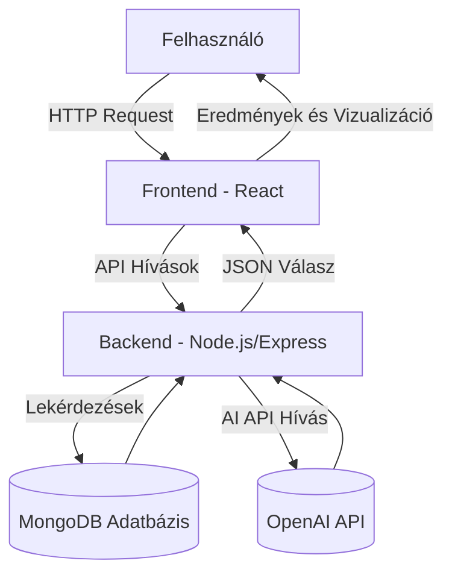
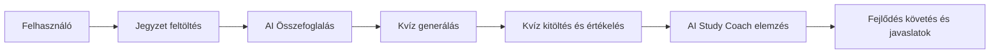

## 1. Rendszeráttekintés

A **StudyMate AI** egy webalapú tanulástámogató platform, amely a mesterséges intelligencia segítségével automatizálja a tanulási folyamatokat.  
A rendszer célja, hogy a hallgatók által feltöltött jegyzetekből automatikusan összefoglalókat, kvízkérdéseket és személyre szabott tanulási javaslatokat generáljon.

A rendszer fő komponensei három rétegben helyezkednek el:

- **Frontend:** React + TailwindCSS technológiával készült interaktív felhasználói felület.
- **Backend:** Node.js + Express alapú REST API, amely az üzleti logikát és az AI-integrációkat kezeli.
- **Adatbázis:** MongoDB dokumentum-alapú adatbázis, amely a jegyzeteket, kvízeket és AI-javaslatokat tárolja.

A rendszer architektúrája réteges, moduláris és skálázható, lehetővé téve új funkciók és szolgáltatások hozzáadását anélkül, hogy a fő funkciókat módosítani kellene.

### 1.1 Architektúra leírása

A rendszer **háromrétegű architektúrán** alapul: prezentációs réteg, logikai réteg és adatkezelési réteg.  
A komponensek között **REST API-n keresztüli kommunikáció** történik JSON formátumban.

A **prezentációs réteg** biztosítja a vizuális interakciókat (React), a **logikai réteg** az adatfeldolgozást (Express), az **adatkezelési réteg** pedig a MongoDB-ben tárolja az entitásokat.

### 1.2 Cél és használati környezet

A StudyMate AI célja, hogy egy **oktatási segédrendszerként** szolgáljon, amelyet hallgatók, oktatók és önálló tanulók egyaránt használhatnak.  
A rendszer **felhőalapú környezetben** működik, támogatva a többfelhasználós hozzáférést és az adatbiztonságot (HTTPS, JWT, titkosított adattárolás).

---

## 2. Projektleírás és célkitűzések

A projekt célja egy olyan intelligens tanulási ökoszisztéma megteremtése, amely automatizálja a tanulási folyamatokat, és adatvezérelt módon segíti a felhasználók fejlődését.

A fő funkciók közé tartozik:

- **Jegyzetfeltöltés:** szöveges vagy PDF formátumban.
- **Automatikus összefoglalás:** AI által készített, 3 bekezdéses kivonat.
- **Kvízgenerálás:** a jegyzet alapján 5–10 kérdés.
- **Kvízkitöltés:** pontozás, eredmény-elemzés.
- **AI Study Coach:** tanulási javaslatok a gyenge pontok alapján.

A projekt első verziója MVP szinten az alapfunkciókra koncentrál, de a rendszer nyitott a további bővítésekre, mint például adaptív tanulási útvonalak, gamifikáció vagy közösségi tanulás.

---